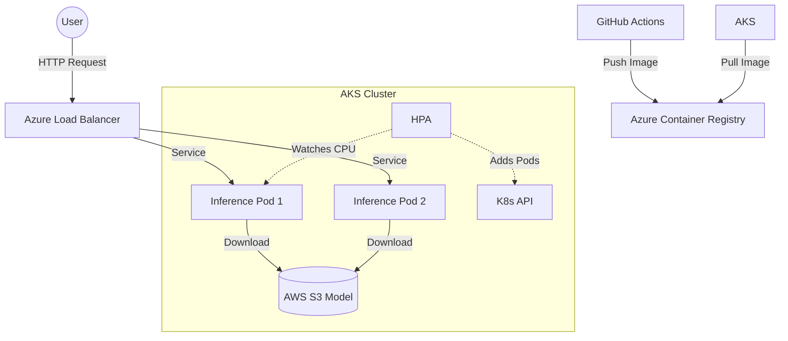

# Kubernetes (AKS) & Container Registry (ACR) ☸️

This document explains the **infrastructure** hosting our project. We moved from running Docker on a single machine to orchestrating it with **Kubernetes** on Azure.

---

## 1. The Theory: What is Kubernetes?

Imagine a conductor (Kubernetes) managing an orchestra (Docker Containers).
- **Docker** runs a single instrument (container).
- **Kubernetes** ensures every instrument plays at the right time, loud enough (scaling), and restarts them if a string breaks (healing).

### Key Concepts

| Term | Analogy | Technical Definition |
|------|---------|----------------------|
| **Cluster** | The entire orchestra | A set of machines (Nodes) running Kubernetes. |
| **Node** | A single musician | A Virtual Machine (VM) that runs the pods. |
| **Pod** | The instrument case | The smallest unit. Usually contains 1 container (e.g., our Inference API). |
| **Deployment** | The Sheet Music | Defines "I want 3 violins always playing". It manages Pod replicas. |
| **Service** | The Microphone | Provides a stable IP address/URL to access the Pods from outside. |
| **HPA** | The Volume Knob | Horizontal Pod Autoscaler. Automatically adds Pods when CPU usage spikes. |

---

## 2. Azure Kubernetes Service (AKS)
Kubernetes is notoriously hard to install from scratch.
**AKS** is Azure's managed version.
- Azure manages the "Control Plane" (The Brain) for free.
- We only pay for the "Nodes" (The Workers).

---

## 3. Azure Container Registry (ACR)
**ACR** is essentially "GitHub for Docker Images".
- We build our Docker image locally or in CI.
- We push it to ACR (`mlopsfraud.azurecr.io`).
- AKS pulls the image from ACR to run it.

---

## 4. How We Implemented It

We defined our infrastructure as code using YAML manifests in `kubernetes/aks/`.

### 4.1 The Inference Service (`inference.yaml`)
This handles the real-time API.

*   **Kind: Deployment**
    *   We request **2 Replicas** (Pods) by default. This ensures high availability. If one crashes, the other takes over.
    *   We set **Resources**: `requests: cpu: 500m`. This guarantees half a CPU core for each pod.
    *   **Liveness Probe**: K8s pings `/health` every 10 seconds. If it fails 3 times, K8s kills the pod and starts a new one.

*   **Kind: Service (LoadBalancer)**
    *   This gives us a **Public IP**.
    *   It routes traffic from the internet (`Port 80`) to our container (`Port 8000`).

*   **Kind: HorizontalPodAutoscaler**
    *   **Min**: 2 Pods.
    *   **Max**: 8 Pods.
    *   **Trigger**: If CPU usage > 50%, add more pods.

### 4.2 The Training Job (`training.yaml`)
This handles the retraining pipeline.

*   **Kind: Job** (Not Deployment!)
    *   A Deployment is for "always-on" services.
    *   A Job is for "run once and finish".
    *   When we apply this, it spins up a Pod, runs `dvc repro`, pushes the model to S3, and then the Pod **terminates**. It doesn't waste money running idle.
    *   **GPU Support**: We can schedule this on a T4 GPU node pool (`resources: limits: nvidia.com/gpu: 1`) for faster training.

### 4.3 Secrets Management
We didn't hardcode AWS keys in the YAML files.
Instead, our CI/CD pipeline runs:
```bash
kubectl create secret generic app-secrets ...
```
And our YAML refers to them:
```yaml
env:
  - name: AWS_ACCESS_KEY_ID
    valueFrom:
      secretKeyRef:
        name: app-secrets
        key: AWS_ACCESS_KEY_ID
```
This is security best practice.

---

## 5. Architectural Diagram


